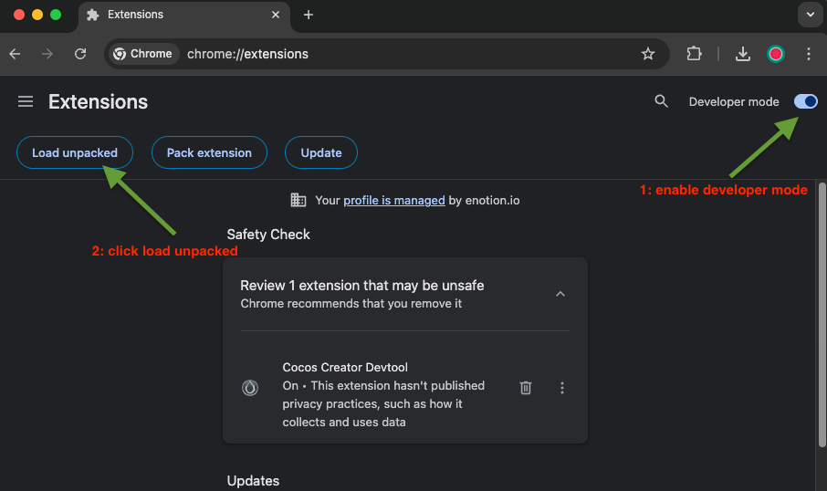
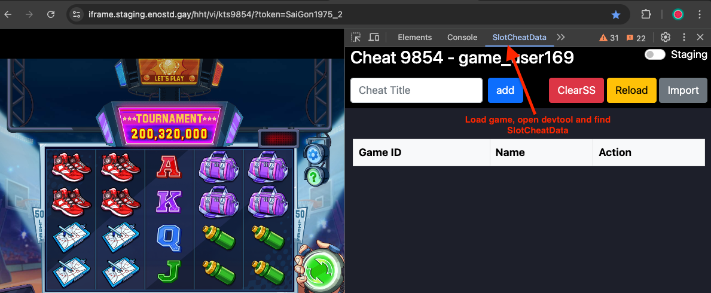

# Tool Cheat Slot

## 🚀 Setup 
1. Navigate to [chrome://extensions/](chrome://extensions/)
2. Enable "Developer mode" and click "Load unpacked extension"
   
3. Open extension and add your scenario
   

---

## 📝 ID Naming Convention (For Developers)

### Prefix Structure
`[view]_[component-type]_[name]`

### View Prefixes
| Prefix | Description |
|--------|-------------|
| `m_` | Main View |
| `s_` | Setup View |
| `e_` | Execution View |

### Component Types
| Prefix | Component |
|--------|-----------|
| `view_` | Container/View |
| `btn_` | Button |
| `txt_` | Text/Label |
| `inp_` | Input field |
| `chk_` | Checkbox |
| `tbl_` | Table |
| `lst_` | List |
| `ico_` | Icon/Indicator |

### Examples
- `m_btn_add`: Add button in main view
- `s_txt_title`: Title in setup view
- `e_ico_status`: Status indicator in execution view